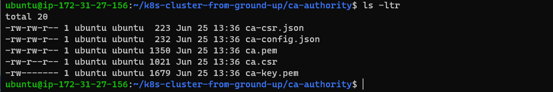
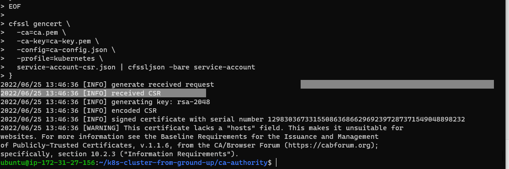
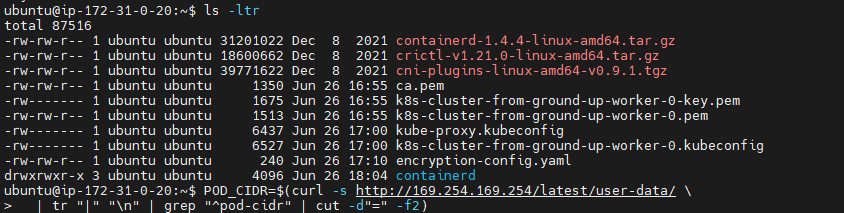

# DOCUMENTATION OF PROJECT 21

1. I created the necessary AWS cloud resources for kubernetes cluster

   
    
     
     
     
     
     
     

2. I checked what was created on aws console

    
     
     
     

3. I created Compute reourses;

a. Image ID
b. keypair
c. Instances for control planes
d. Instances for worker nodes

     
     
     
     
     
     
     

4. I prepared the certificate authority and generated TLS certificates

     
     
     
     
     
     
     
     
     
     
     
     
     
     
     
     
     
     
     
     
     
     
     

5. I prepared the etcd database for encryption at rest

    

6. I created an encryption-config.yaml file according to kubernetes

   
  
7. Then I ssh into the master nodes one after the other and ran the necessary commands

   
   
   
   
   
   
   
   
   

8. I verified if the ETCD server is running
    

9. I configured the components for the control plane on the master nodes

   
   
   
   

10. Then I tested evrything to see if it's working fine

   
   
   
   

11. I configured the worker nodes, installed containerd and verified if everything is working

   
   
   
   
   
   
   